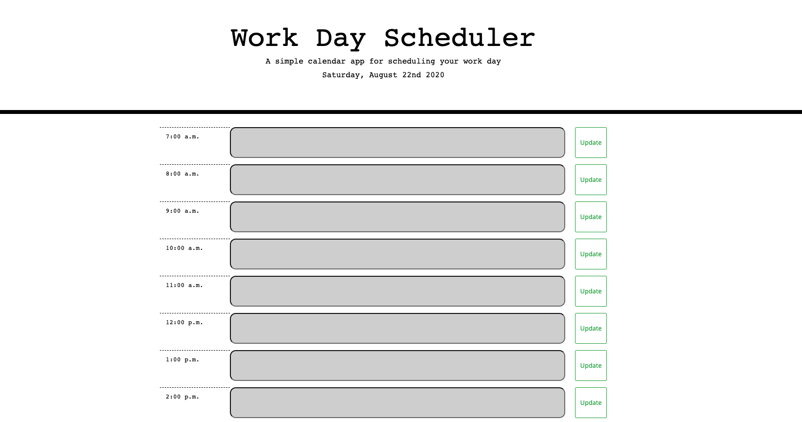

# DAY PLANNER

## PURPOSE:
This app helps organize a day's events. It allows a person to save daily plans based on the hours of the day. The colors of the boxes change based on if the event is present, past, or upcoming. The events can be saved to local storage so that upon returning to the page it still contains the information inputted previously. There is a "clear" button at the bottom of the page that erases all entries. The header area features a current clock.

## USES:
Moment.js, Bootstrap, HTML, CSS, JavaScript, jQuery

## RUN
To run this project, click on the "deployable application" link below. Enter your reservations hourly, and click "update" to add them to your calendar.

### SCREENSHOT

### LINKS
Deployable Application: https://maxonemillion.github.io/day-planner/

Github: https://github.com/maxonemillion/day-planner 
